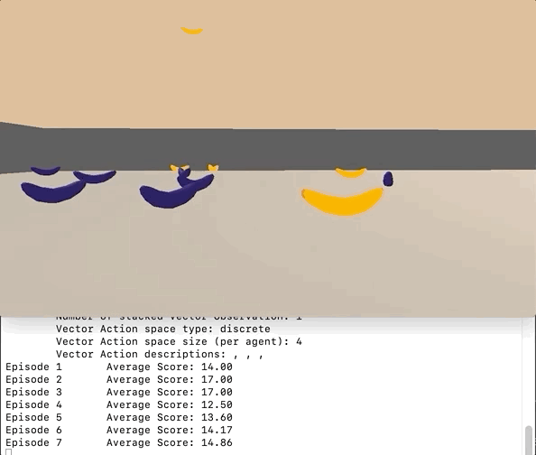

# RL_Navigation
Udacity Reinforcement Learning Navigation Project Using Deep Q-Learning

### The Environment Description:
1. Set-up: A multi-agent environment where agents compete to collect bananas.
2. Goal: The agents must learn to move to as many yellow bananas as possible while avoiding blue bananas.
3. Agents: The environment contains 5 agents linked to a single Brain.
4. Agent Reward Function (independent):
    +1 for interaction with yellow banana
    -1 for interaction with blue banana.
5. Brains: One Brain with the following observation/action space.
6. Vector Observation space: 37 dimensions and contains the agent's velocity, along with ray-based perception of objects around the agent's forward direction.
7. 0 - move forward, 1 - move backward, 2 - turn left, 3 - turn right
8. Benchmark Mean Reward: 10

The enviornment provides the following states regarding

Actions:

The goal is to select
Reward: +1 -1

To start:
Clone the repostiroy:
Run Navigation.ipynb
The file has two dependencies
model.py

The enviornement is Banana app

Report.md:
Describe the results of the analysis

Weights are stored in model.pth
