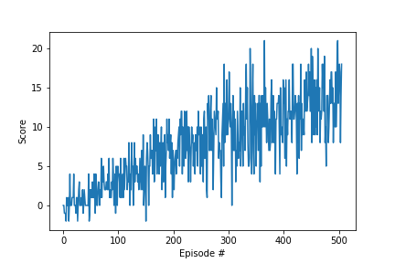

## Deep Q-Learning report

### Architecture of the algorithm:
1. Random weight initialization for both local and target networks.
2. E-Greedy was used with decay.
3. Observe reward and calculate error function.
4. minimize error, and update target network periodically

### Hyperparameters:
#### Training hyperparameters
N_EPISODES=2000  
MAX_T=1000  
EPS_START=1.0  
EPS_END=0.01  
EPS_DECAY=0.995  

#### Neural Network hyperparameters
FC1_UNITS=64  
FC2_UNITS=64  

#### Deep Q-Learning hyperparameters
BUFFER_SIZE = int(1e5)  # replay buffer size  
BATCH_SIZE = 64         # minibatch size  
GAMMA = 0.99            # discount factor  
TAU = 1e-3              # for soft update of target parameters  
LR = 5e-4               # learning rate  
UPDATE_EVERY = 4        # how often to update the network  

### Results of the analysis:
Episode 100	Average Score: 1.31  
Episode 200	Average Score: 5.04  
Episode 300	Average Score: 8.31  
Episode 400	Average Score: 10.32  
Episode 500	Average Score: 12.76  
Episode 506	Average Score: 13.00  
Environment solved in 406 episodes!	Average Score: 13.00  

### Optimization next steps:
Q-learning often over-estimates the value function especially early in the training. Double Q network and Dueling Q network can help overcome this. Double Q network works by having two different Q tables. At each timestep, we pick one of them to determine the maximizing action, and we use the other one to calculate the estimate. We would use both to select actions by using the average of both Q(s) estimates. While Dueling Q network works by branching the network and then combine the state and advantage values.
